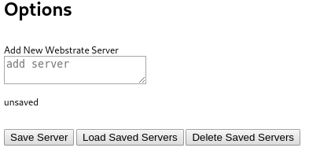
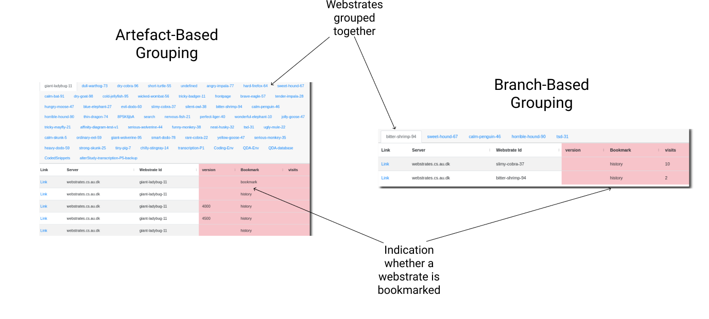
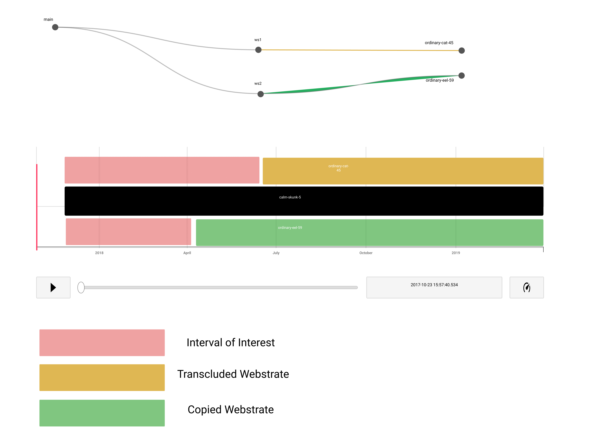

# Chrome Extension for webstrates bookmark extraction

## Installation
Link on [zip archive](https://github.com/Stalkcomrade/webstrates-chrome-extension/raw/master/ext.zip)

## Usage
1) Configure Server via Options 

2) Open any webstrate on a server you want your projects to be composed
3) Open extension

## Description:   

Basic idea is to provide simple grouping for webstrates. Two groupping principles are used:

## TODO:

## Tests

1) I had a hard time of trying to incorporate puppeteer + vue mounting + mocha + webpack for, sort of, integration test. I could not do this, that is why some of the tests are only on the client side.  

./tests/main.test.js checks whether extension is build, launched and basic layout is rendered.  

2) Some of the tests are done on the client side. For instance, one might be accessible by going to the url:
chrome-extension://<extensionId>/tests.html

./tests/componentsVue.test.js checks whether user options are extracted correctly.

